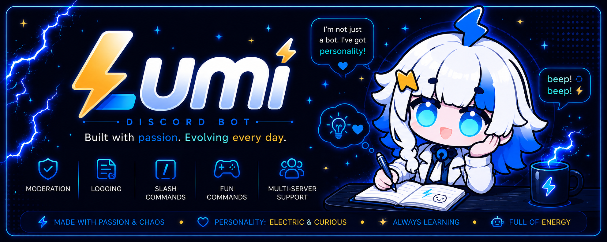

  

<h1 align="center">⚡ Lumi</h1>

  Un bot Discord francophone pour modérer, logger, aider la communauté et ajouter une petite étincelle au serveur.

  
  
  
  

  
  
  
  

---

## ✨ Qui est Lumi ?

Lumi est un bot Discord francophone créé par **ConnieCozy** et développé avec **HexBoon Development**.

Elle est pensée pour accompagner une communauté sur le long terme : modération, logs, utilitaires, AutoMod, commandes fun et petites interactions qui donnent plus de vie au serveur.

Lumi n'est pas juste un bot à commandes. Elle a son ton : douce, drôle, parfois sarcastique, toujours un peu électrique.

> Short English summary: Lumi is a French Discord bot focused on moderation, logs, utility commands and long-term community tools.

---

## 🛠️ Ce que Lumi apporte

### 🛡️ Un serveur mieux encadré

Lumi aide les équipes de modération avec des outils clairs pour gérer les avertissements, les sanctions, les infractions et les actions importantes du serveur.

### 🚨 Une protection automatique

Lumi peut surveiller les comportements problématiques comme le spam, les raids ou les messages répétés, avec des réglages adaptés à chaque serveur.

### 📜 Une meilleure visibilité

Les logs permettent de garder une trace des événements importants : modération, commandes, messages, arrivées, départs et actions AutoMod.

### 🎲 Des commandes utiles et plus légères

Lumi propose aussi des commandes pratiques et fun pour rendre le serveur plus vivant sans transformer l'expérience en tableau de bord froid.

### ⚡ Une vraie personnalité

Au-delà des commandes, Lumi garde une identité reconnaissable : douce, drôle, un peu sarcastique, et toujours branchée sur le courant.

---

## 📢 État du projet

Lumi est en développement actif.

Le projet avance par étapes : d'abord la stabilité, ensuite l'expérience utilisateur, puis les fonctionnalités communautaires plus avancées.

Chaque version sert à rendre Lumi plus fiable, plus agréable, et plus facile à maintenir sur le long terme.

---

## 🧰 Stack technique

Lumi est construite avec :

- **Node.js** pour le runtime
- **Discord.js v14** pour l'intégration Discord
- **Prisma** pour l'accès base de données
- **PostgreSQL / Neon** pour les données
- **Render** pour l'hébergement
- **GitHub** pour le suivi du projet

---

## 🗺️ Roadmap

- [x] Commandes slash
- [x] Système de modération
- [x] Système de logs
- [x] AutoMod
- [x] Stabilisation et sécurité v3.2
- [x] UX commandes et personnalité v3.3
- [ ] Documentation utilisateur complète
- [ ] Audit des commandes à garder, modifier ou retirer
- [ ] Expérience utilisateur complète autour de Lumi
- [ ] Outils communautaires avancés
- [ ] Fonctionnalités IA légères
- [ ] Dashboard web

---

## 🌐 Liens

- 🎮 Twitch : [ConnieCozy](https://www.twitch.tv/conniecozy)
- 💬 Support Discord : [Lumi Support](https://discord.gg/wJ8xjWJ2Nd)
- ⚡ Projet : développé avec soin par **ConnieCozy** et **HexBoon Development**

---

## 🔒 Licence et protection

Lumi, son nom, son identité visuelle, ses assets et son code sont protégés.

Ce projet est public pour consultation uniquement lorsque publié sur un dépôt vitrine. Toute copie, modification, redistribution ou réutilisation du code, des assets ou du personnage Lumi nécessite une autorisation explicite.

Consultez [LICENSE.md](LICENSE.md) pour les conditions complètes.

---

  ⚡ Lumi veille. Probablement avec un peu trop d'énergie.

