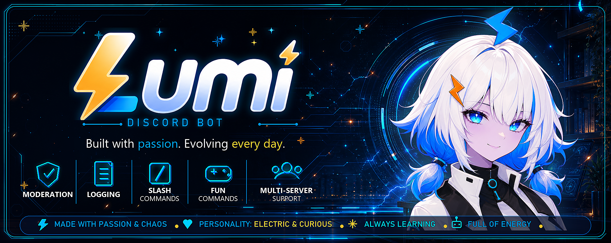
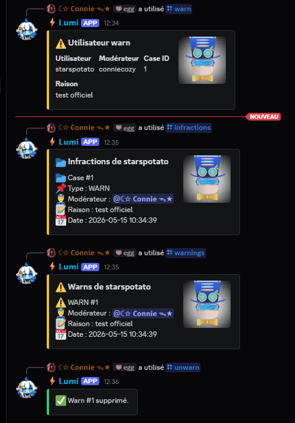
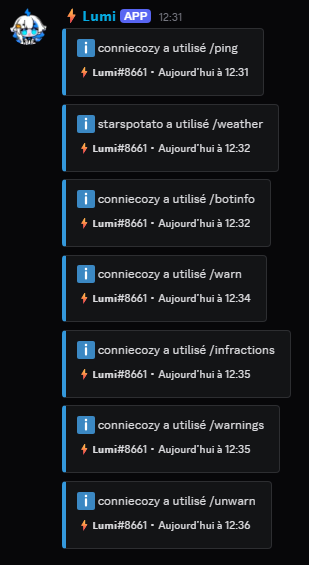
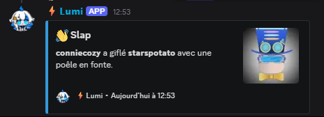

  

<h1 align="center">⚡ Lumi</h1>

  A personal multi-purpose Discord bot built with passion, curiosity and too much caffeine.

🚧 Project Status: In active development • Not available 24/7

---

  
  
  
  
  
  

  
  
  
  
  

---

# ✨ About

Lumi is a personal Discord bot project created to learn, experiment and build things over time.

It is not a finished product, but an evolving system that improves step by step with new ideas and features.

Built for:
- community management
- moderation
- fun commands
- experimentation
- Twitch integration
- future AI systems (?)

---

# 🚀 Features

- 🛡️ Moderation system
- 📜 Logging system
- ⚡ Slash commands
- 🎮 Fun & utility commands
- 🔧 Constant evolution
- 🌐 Multi-purpose architecture

---

# 📸 Screenshots

## 🛡️ Moderation
 

---

## 📜 Logs

---

## 🎮 Fun commands

---

## 🛠️ Utility commands

---

# 🚧 Roadmap

- [x] Warning system
- [x] Logging system
- [ ] AutoMod system
- [ ] Music system
- [ ] Twitch integration
- [ ] AI features
- [ ] Dashboard
- [ ] More chaos

---

# 🌙 Philosophy

Learn.
Build.
Break things.
Fix them.
Repeat.

---

# ⚠️ Disclaimer

This is a personal amateur project built with passion and curiosity.

Some features may break.
Some ideas may change or disappear over time.
Lumi is self-hosted and not available 24/7.

---

# 🌐 Community

- 🎮 Twitch: [ConnieCozy](https://www.twitch.tv/conniecozy)  
- 💬 Discord: [Lumi Support](https://discord.gg/wJ8xjWJ2Nd)
- 📢 Updates: GitHub repository
